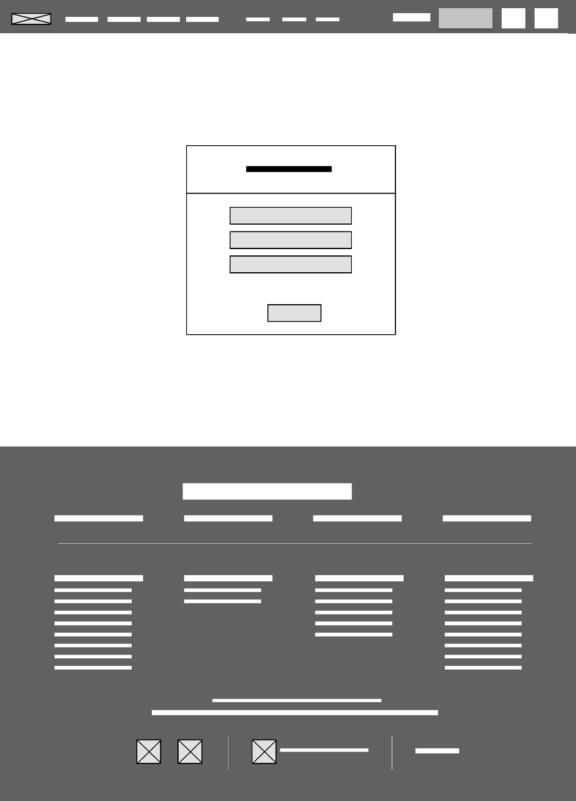
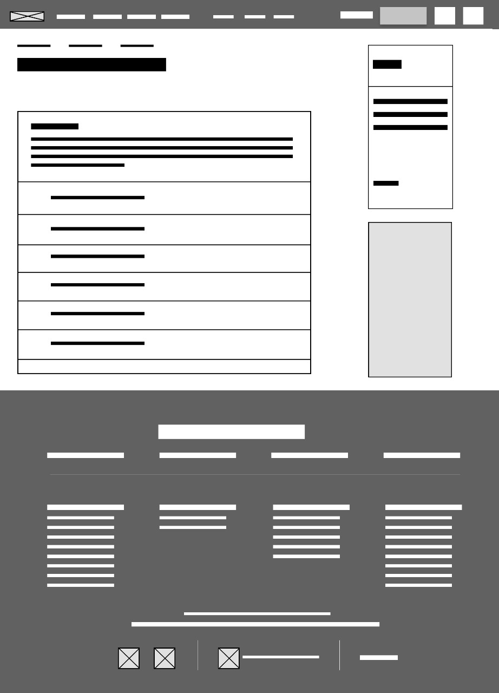
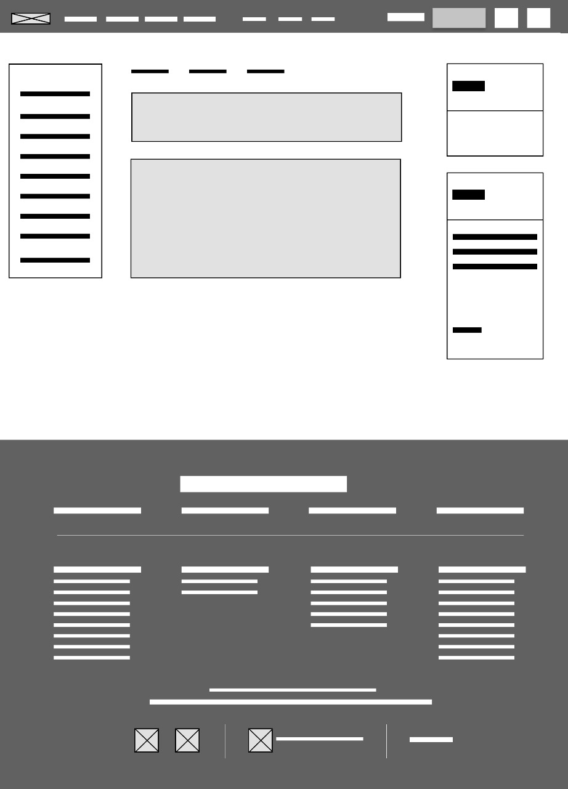
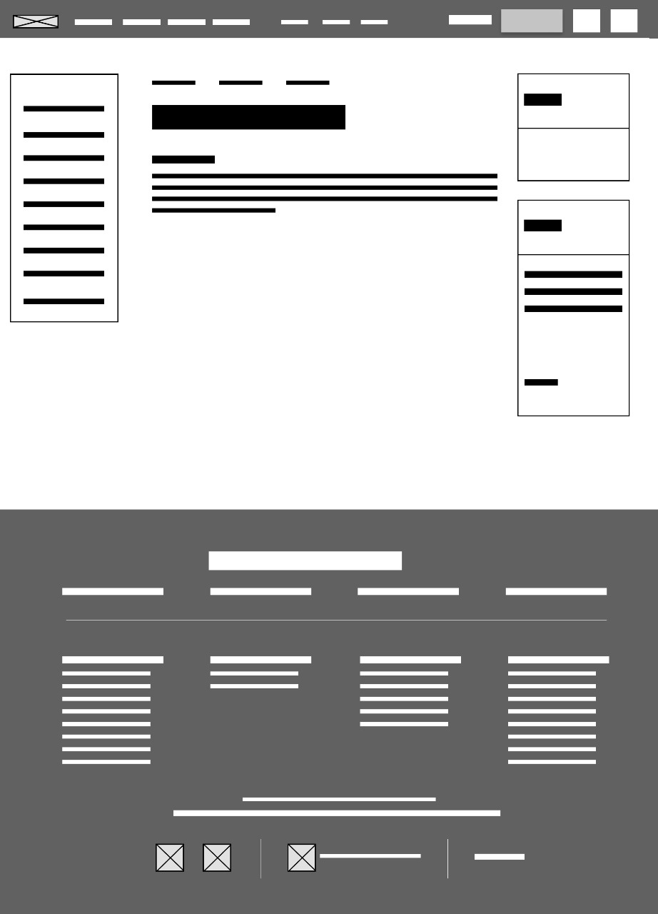
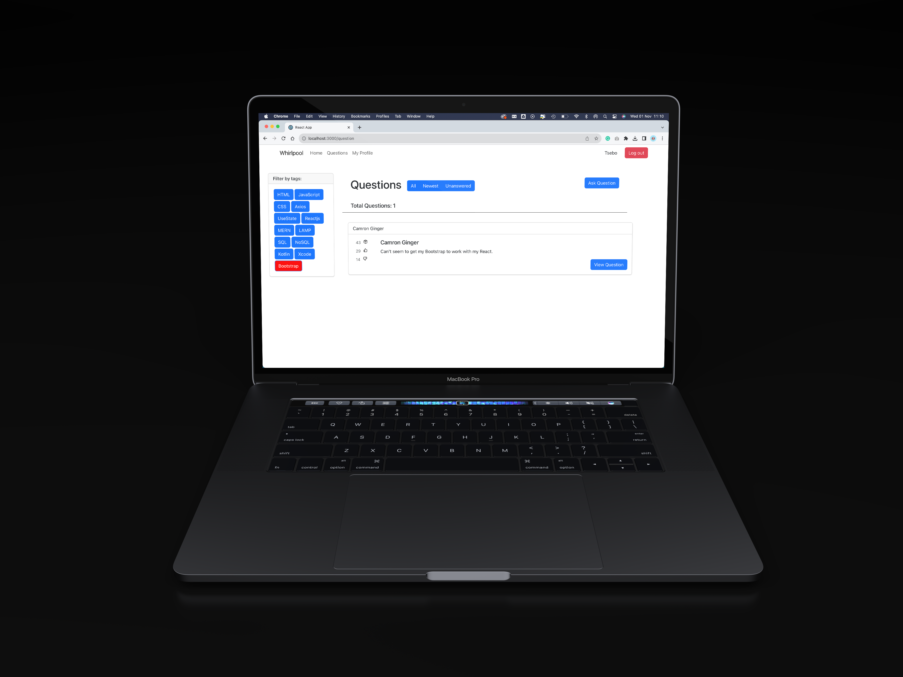

<h5 align="center" style="padding:0;margin:0;">Christian Krahtz | Glen Dorner | Hannah Naidoo | Tsebo Ramonyalioa </h5>
<h5 align="center" style="padding:0;margin:0;">221198 | 221358 | 21100366 | 200200</h5>
<h6 align="center">DV200 | Term 4</h6>

  
  <h3 align="center">Whirlpool</h3>
  
This is a MERN Stack Q&A

## Table of Contents

- [About the Project](#about-the-project)
    - [Project Description](#project-description)
    - [Built With](#built-with)
- [Getting Started](#getting-started)
    - [Prerequisites](#prerequisites)
    - [Installation](#installation)
- [Concept Process](#concept-process)
    - [Ideation](#ideation)
    - [Wireframes](#wireframes)
- [Development Process](#development-process)
    - [Implementation Process](#implementation-process)
        - [Highlights](#highlights)
        - [Challenges](#challenges)
    - [Future Implementation](#future-implementation)
- [Final Outcome](#final-outcome)
    - [Mockups](#mockups)
    - [Walkthrough](#walkthrough)
    - [Deployed Site](#deployed-site)
- [License](#license)
- [Acknowledgements](#acknowledgements)

# About the Project
## Project Description
Welcome to Whirlpool! This is a developer's Q&A platform, something you probably have seen on sites like Stack Overflow. This is exactly the same thing, except we took our own spin on it! Users can ask and answer questions, receive achievements based on user scores, and much, much more. This application was built with the MERN Stack

## Built With
 
 
 
 
 
 

# Getting Started
These instructions will get you a copy of the project up and running on your local machine for development and testing purposes.

## Prerequisites
For development, the latest version of Node.js is required. The latest version can be downloaded from [Node.js](https://nodejs.org/en/download/)

## Installation
Here are a couple of ways to clone this repo:
1.  GitHub Desktop  
    Enter `https://github.com/GlenDorner221358/Whirlpool.git` into the URL field and press the `Clone` button.

2.  Clone Repository  
    Run the following in the command line to clone the project:
    
        git clone https://github.com/GlenDorner221358/Whirlpool.git
 
4.  Install Dependencies  
    Run the following in the command line to install all the required dependencies:

        npm install

# Concept Process

We really went with a simple and minimalistic UI design. Whirlpool is there to be functional and helpful to any newcomer or veteran of Whirlpool. Where they can simply ask, answer, and view questions in a quick, concise, and effective way. We stick to a simple yellow with accents of a baby blue palette. A UI trend that really started to rise among web apps was rounded corners, so we also incorporated that into our design, just to round it off even further.

## Ideation

We wanted to replicate Stack Overflow. You can view the web page <a href="https://stackoverflow.com/">here</a>.

## Wireframes

### Login

### Home/Landing

### Question

### Single Question

# Development Process

The `Development Process` is the technical implementations and functionality done for the app.

## Implementation Process

- I used `npx create-react app` to create this React project. I implemented component-based development instead of classes. By doing this, I will be able to easily inject and eject components and sub-components into my project, making it refactorable and reusable instead of writing up classes I have to do every time making it tedious and redundant

- I obeyed the `saas` styling of my project which is slightly different from `scss` as the manner in which indentation has been applied is important and semi-colons are not allowed 

- `Axios` was implemented so that I can make HTTP requests to the BallDontLie API so that I can dynamically display these datasets on a magic chart called charts.js version 5

### Highlights

stipulated the highlight you experienced with the project

- The search functionality was surprisingly easy to implement
- Cursor with gpt4 makes the workload painlessly efficient
- Working in a group allowed us to efficiently split the workload so no one was overwhelmed

### Challenges

stipulated the challenges you faced with the project and why you think you faced them or how you think you'll solve them (if not solved)

- Updating all of the data entries in our database when we made a change to the models
- The routes were a massive pain to get working
- Image uploading was a nightmare
- The styling was also quite a challenge, some components did not cooperate no matter the amount of CSS we threw at them
- one thing we had an issue with was Mac and Windows compatibility when addressing the node modules as we had to delete and reinstall the modules every time someone committed their changes on Github

## Future Implementation

stipulate functionality and improvements that can be implemented in the future.

- We would love to make our Front-end better than it is 

# Final Outcome

## Mockups

### Profile Page

### Home/Landing

### Question

### Single Question

### Single Questions Filter

### Login 

### Register 

## Walkthrough

You can view the walkthrough video <a href="https://drive.google.com/file/d/1xgmkC0OvS-_fuqtiHQIZKY5BHqz9ktbV/view?usp=sharing">here</a>

## Deployed Site
To view the deployed website click on the name here: <a href="https://whirlpool-christian-d7caed119382.herokuapp.com/">Whirlpool</a>

# Author
- **Christian Krahtz** - [Github](https://github.com/CWKrahtz)
- **Glen Dorner** - [Github](https://github.com/GlenDorner221358)
- **Hannah Naidoo** - [Github](https://github.com/HannahAmaria)
- **Tsebo Ramonyalioa** - [Github](https://github.com/Tsebo200)

# License

Distributed under the MIT License. See `LICENSE` for more information.\

- **Original Project Link** - https://github.com/GlenDorner221358/Whirlpool

# Acknowledgements

- [Stack Overflow](https://stackoverflow.com/)
- [Figma](https://www.figma.com/)
- [ChatGPT](https://chat.openai.com/)
- [Cursor](https://cursor.sh/)
